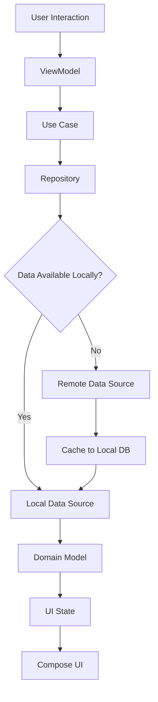

# Valorant Agents App - Development Context

## Project Overview

**Valorant Agents** is an Android application built with Jetpack Compose that provides information about Valorant game agents. The app fetches agent data from a remote API and stores it locally for offline access, displaying detailed information about each agent including their abilities, roles, and backgrounds.

## Problem Domain & Purpose

The app solves the following problems:
1. **Information Access**: Provides easy access to detailed Valorant agent information
2. **Offline Browsing**: Allows users to view agent data without internet connectivity after initial load
3. **Visual Experience**: Offers a modern, visually appealing interface to explore agent details
4. **Quick Reference**: Serves as a reference tool for Valorant players to understand agent capabilities

## Architecture Overview

The project follows **Clean Architecture** principles with clear separation of concerns:

### Layer Structure
```
📁 Presentation Layer (UI)
├── 🎨 Compose UI Components
├── 📱 Screens (Home, Agent Details)
├── 🔄 ViewModels (State Management)
└── 📊 UI States

📁 Domain Layer (Business Logic)
├── 🎯 Use Cases (GetAgents, GetAgentDetails)
├── 📋 Repository Interfaces
└── 🏗️ Domain Models (AgentUiModel)

📁 Data Layer
├── 🌐 Remote Data Source (API)
├── 💾 Local Data Source (Room DB)
├── 🔄 Repository Implementation
└── 🗂️ Data Models & Mappers
```

## Technology Stack

### Core Technologies
- **Kotlin**: Primary programming language
- **Jetpack Compose**: Modern UI toolkit
- **Material Design 3**: UI design system
- **Coroutines & Flow**: Asynchronous programming
- **Koin**: Dependency injection

### Data & Networking
- **Ktor Client**: HTTP client for API calls (v3.2.3)
- **Kotlin Serialization**: JSON serialization/deserialization
- **Room**: Local database (SQLite)
- **Coil**: Image loading and caching

### Architecture Components
- **Navigation Compose**: Screen navigation
- **ViewModel**: UI state management
- **Lifecycle**: Lifecycle-aware components

## Project Structure Deep Dive

### 1. Data Layer (`/data`)

#### Remote Data Source
- **`ApiService`**: Ktor-based service class for API endpoints (`/agents`)
- **`AgentsRDS`**: Remote data source interface
- **`AgentsRDSImpl`**: Ktor client implementation
- **`AgentResponseModel`**: API response models with Kotlin Serialization annotations

#### Local Data Source
- **`ValoAgentDatabase`**: Room database configuration (version 3)
- **`AgentDao`**: Database access object with CRUD operations
- **`AgentEntity`**: Local storage entities with type converters
- **`AgentsLDS`**: Local data source interface

#### Repository Pattern
- **`AgentRepository`**: Domain contract interface
- **`AgentRepositoryImpl`**: Implementation with offline-first caching logic

### 2. Domain Layer (`/domain`)

#### Models
- **`AgentUiModel`**: UI-specific data models
- **`RoleUiModel`**: Agent role information
- **`AbilityUiModel`**: Agent ability details
- **Mapper Functions**: Convert between data and domain models

#### Use Cases
- **`GetAgents`**: Business logic for fetching agent list
- **`GetAgentDetails`**: Business logic for single agent details
- Clean separation of concerns with interface/implementation pattern

### 3. Presentation Layer (`/ui`)

#### Screens
- **`HomeScreen`**: Displays grid of agents with staggered layout
- **`AgentDetailScreen`**: Shows detailed agent information with vertical pager
- **Navigation**: Type-safe navigation with Kotlin serialization

#### State Management
- **`AgentsListUiState`**: Sealed interface for list states (Init, Loading, Success, Error, NoInternet)
- **`AgentDetailUiState`**: Sealed interface for detail states
- **ViewModels**: Handle business logic and state using StateFlow

#### Components
- **`AgentItem`**: Individual agent card component
- **`AllAgentsList`**: Grid layout for agents
- **`AgentAbilities`**: Display agent abilities
- **`AgentRole`**: Display agent role information
- **Loading States**: Consistent loading indicators

## Key Features

### 1. Offline-First Architecture
- Data is cached locally using Room database
- Repository checks local data first, fetches remote if needed
- Graceful offline experience with `NoInternetException` handling

### 2. Modern UI/UX
- Jetpack Compose with Material Design 3
- Staggered grid layout for visual appeal
- Vertical pager for immersive detail view
- Custom fonts (Valorant, Inter, Playfair Display)
- Dark/light theme support

### 3. Error Handling
- `ResultState<T>` sealed interface for consistent error handling
- Custom exceptions (`NoInternetException`, `HttpException`, `CustomException`)
- Ktor-specific exception handling (`ResponseException` for HTTP errors)
- User-friendly error messages with `getErrorMessage()` extension

### 4. Navigation
- Type-safe navigation with Kotlin serialization
- Screen definitions as serializable objects:
  - `Screen.HomeScreen`
  - `Screen.AgentDetail(uuid: String)`

## Data Flow



## Dependency Injection Structure

### Koin Modules
```kotlin
// App initialization
initKoin(context) {
    modules(
        appModule,           // ViewModels
        networkModule,       // Ktor HttpClient
        apiModule,          // ApiService
        valoAgentsLocalModule,  // Room, DAO
        valoAgentsRemoteModule, // Remote data sources
        repositoryModule,    // Repository implementations
        agentUseCaseModule, // Use case implementations
    )
}
```

## API Integration

### Valorant API
- **Base URL**: Configured in network module
- **Endpoint**: `GET /agents`
- **Response Model**: `AgentListResponse`
- **Agent Data Includes**:
  - UUID, display name, description
  - Display icon, full portrait images
  - Background image
  - Role information (name, icon, description)
  - Abilities list (slot, name, description, icon)

### Data Models
```kotlin
// API Response
@Serializable
data class AgentResponseModel(
    @SerialName("uuid")
    val uuid: String,
    @SerialName("displayName")
    val displayName: String,
    @SerialName("displayIcon")
    val displayIcon: String,
    @SerialName("isPlayableCharacter")
    val isPlayableCharacter: Boolean,
    @SerialName("description")
    val description: String,
    @SerialName("fullPortrait")
    val fullPortrait: String? = "",
    @SerialName("fullPortraitV2")
    val fullPortraitV2: String? = "",
    @SerialName("background")
    val background: String? = "",
    @SerialName("role")
    val role: Role? = null,
    @SerialName("abilities")
    val abilities: List<Ability>? = null
)

// Domain Model
data class AgentUiModel(
    val uuid: String,
    val displayName: String,
    val displayIcon: String,
    val isPlayableCharacter: Boolean,
    val description: String,
    val fullPortrait: String,
    val fullPortraitV2: String,
    val background: String,
    val role: RoleUiModel,
    val abilities: List<AbilityUiModel>
)
```

## Development Guidelines

### 1. Code Organization
- Follow package-by-feature structure
- Use `internal` visibility modifiers for implementation details
- Maintain clear separation between layers
- Each layer has its own DI module

### 2. State Management
- Use `StateFlow` for reactive state management
- Implement proper loading/error states
- Handle configuration changes gracefully with `collectAsStateWithLifecycle()`
- Use sealed interfaces for UI states

### 3. Error Handling
- Use `ResultState<T>` for all data operations
- Implement specific exception types
- Provide meaningful error messages to users
- Handle network connectivity issues gracefully

### 4. Testing Strategy
- Unit tests for ViewModels and Use Cases
- Repository tests with mock data sources
- UI tests for critical user flows
- Test error scenarios and edge cases

## Build Configuration

### Gradle Setup
- **Kotlin**: 2.0.0
- **Compose Compiler**: 2.0.0
- **Target SDK**: 35
- **Min SDK**: 21
- **Compile SDK**: 35

### Key Dependencies (libs.versions.toml)
```toml
[versions]
kotlin = "2.0.0"
compose = "1.5.4"
compose-material3 = "1.1.2"
koin = "4.0.1"
ktor = "3.2.3"
room = "2.5.2"
coil = "2.4.0"
navigation-compose = "2.9.0"
```

## Future Enhancement Opportunities

### Short Term
1. **Agent Filtering**: Filter by role (Duelist, Controller, Initiator, Sentinel)
2. **Search Functionality**: Search agents by name or ability
3. **Favorites System**: Save favorite agents locally
4. **Better Error UI**: Enhanced error states with retry options

### Medium Term
5. **Enhanced Animations**: Shared element transitions, hero animations
6. **Agent Comparison**: Side-by-side agent comparison feature
7. **Ability Details**: Detailed ability breakdowns with damage/cooldown info
8. **Widgets**: Home screen widgets for quick agent access

### Long Term
9. **Push Notifications**: New agent release notifications
10. **Social Features**: Share favorite agent loadouts
11. **Offline Maps**: Download agent images for complete offline experience
12. **Accessibility**: Enhanced accessibility support
13. **Tablet Support**: Optimized layouts for tablets

## Common Development Tasks

### Adding a New Screen
1. Create screen composable in `/ui/[feature]/`
2. Define UI state sealed interface
3. Create ViewModel with StateFlow
4. Add to navigation graph in `AppNavHost`
5. Add any required use cases and DI modules

### Adding API Endpoint
1. Add endpoint method to `ApiService` class (using Ktor client)
2. Create response model with `@Serializable`
3. Update remote data source interface and implementation
4. Add mapper functions for domain models
5. Update repository and use cases

### Adding Local Storage
1. Define entity with Room annotations
2. Add DAO methods
3. Update database version and migration if needed
4. Add type converters if needed for complex types
5. Update local data source implementation

## Troubleshooting Common Issues

### Build Issues
- Ensure KSP is properly configured for Room
- Check Compose compiler version matches Kotlin version
- Verify all dependencies are compatible

### Runtime Issues
- Check network connectivity for API calls
- Verify database migrations are properly handled
- Ensure proper error handling in data flow

### UI Issues
- Check theme configuration for Material Design 3
- Verify image loading with Coil
- Test on different screen sizes and orientations

## Development Environment Setup

### Prerequisites
- Android Studio Hedgehog or newer
- Java 17+
- Git

### Setup Steps
1. Clone the repository
2. Open in Android Studio
3. Sync Gradle files
4. Run the app on emulator or device

### Recommended Android Studio Plugins
- Kotlin Multiplatform Mobile
- Compose Multiplatform IDE Support
- Rainbow Brackets
- Koin Framework

## Recent Changes and Migrations

### Retrofit to Ktor Migration (Latest)

The project was recently migrated from Retrofit to Ktor Client v3.2.3 for improved Kotlin multiplatform compatibility and modern async programming patterns.

#### Migration Details
- **From**: Retrofit 2.9.0 with OkHttp
- **To**: Ktor Client 3.2.3 with Android engine
- **Date**: Latest update
- **Impact**: Zero breaking changes to domain/UI layers

#### Changes Made
1. **Dependencies Updated**:
   - Removed: `retrofit`, `kotlinx-serialization-converter`
   - Added: `ktor-client-core`, `ktor-client-android`, `ktor-client-serialization`, `ktor-client-content-negotiation`, `ktor-client-logging`

2. **ApiService Refactored**:
   - **Before**: Retrofit interface with annotations
   ```kotlin
   interface ApiService {
       @GET("agents")
       suspend fun fetchAgents(): AgentListResponse
   }
   ```
   - **After**: Ktor service class with HttpClient
   ```kotlin
   class ApiService(private val httpClient: HttpClient) {
       suspend fun fetchAgents(): AgentListResponse {
           return httpClient.get("agents").body()
       }
   }
   ```

3. **Network Configuration**:
   - Replaced OkHttp client with Ktor HttpClient
   - Configured Android engine with timeouts, logging, and content negotiation
   - Maintained same base URL and JSON serialization setup

4. **Error Handling Updated**:
   - **Before**: Handled `retrofit2.HttpException`
   - **After**: Handles Ktor's `ResponseException` (covers client/server errors)
   - Simplified exception hierarchy while maintaining same error mapping

#### Benefits of Migration
- **Modern Async**: Native Kotlin coroutines support
- **Multiplatform Ready**: Ktor supports Kotlin Multiplatform
- **Type Safety**: Better type-safe HTTP client APIs
- **Performance**: More efficient for Kotlin applications
- **Maintenance**: Actively developed by JetBrains

#### Backward Compatibility
- All existing domain models and UI components remain unchanged
- Repository pattern ensures data layer changes are isolated
- Same error handling patterns maintained for UI consistency

---

## Project Team Information
- **Package**: `mfaseeh.compose.valorantagents`
- **Application ID**: `mfaseeh.compose.valorantagents`
- **Version**: 1.0 (Version Code: 1)

This documentation serves as a comprehensive guide for understanding and contributing to the Valorant Agents Android application.