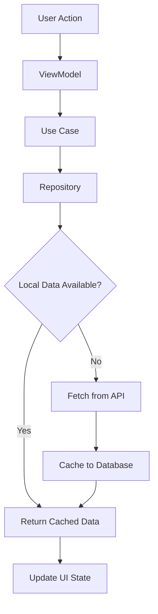

# ValorantAgents - Compose Multiplatform Project Context

## Project Overview

**ValorantAgents** is a Compose Multiplatform application that provides information about Valorant game agents. Built using modern Kotlin Multiplatform technologies, it runs natively on Android, iOS, and Desktop platforms while sharing business logic and UI components across all targets.

### Key Features
- 🎮 **Agent Information**: Browse detailed Valorant agent profiles
- 🔍 **Agent Search**: Search and filter agents by name and abilities
- 💾 **Offline Support**: Local caching with Room database
- 🌐 **API Integration**: Real-time data from Valorant API
- 📱 **Cross-Platform**: Native apps for Android, iOS, and Desktop

## Technical Architecture

### Architecture Pattern
The project follows **Clean Architecture** principles with clear separation of concerns:

```
📱 Presentation Layer (Compose UI + ViewModels)
    ↓
🎯 Domain Layer (Use Cases + Repository Interfaces + Domain Models)
    ↓
💾 Data Layer (Repository Implementation + Data Sources + DTOs)
```

### Technology Stack

#### Core Framework
- **Kotlin Multiplatform**: `2.0.20`
- **Compose Multiplatform**: `1.7.0`
- **Android Gradle Plugin**: `8.7.3`

#### Networking
- **Ktor Client**: `3.2.3` (Cross-platform HTTP client)
- **Platform Engines**:
  - Android/Desktop: OkHttp
  - iOS: Darwin
- **Kotlinx Serialization**: `1.6.2` (JSON parsing)

#### Database
- **Room**: `2.7.0-alpha11` (Multiplatform database)
- **SQLite**: `2.5.0-beta01` (Database driver)

#### Dependency Injection
- **Koin**: `4.0.1` (Lightweight DI framework)
- **Compose Integration**: Koin Compose ViewModels

#### UI & Navigation
- **Navigation Compose**: `2.9.0` (Type-safe navigation)
- **Lifecycle Components**: `2.6.1`
- **Material Design 3**: Modern design system

#### Image Loading
- **Coil**: `3.0.0-rc02` (Multiplatform image loading)

## Project Structure

### Single Module Architecture

```
ValorantAgents/
├── composeApp/                    # Single multiplatform module
│   ├── src/
│   │   ├── commonMain/           # Shared code across all platforms
│   │   │   ├── kotlin/
│   │   │   │   └── mfaseeh/compose/valorantagents/
│   │   │   │       ├── app/      # Main app entry point
│   │   │   │       ├── ui/       # Compose UI components
│   │   │   │       ├── domain/   # Business logic & models
│   │   │   │       ├── data/     # Data layer & repositories
│   │   │   │       └── di/       # Dependency injection
│   │   │   └── composeResources/ # Shared resources
│   │   ├── androidMain/          # Android-specific code
│   │   ├── iosMain/             # iOS-specific code
│   │   └── desktopMain/         # Desktop-specific code
│   └── build.gradle.kts         # All dependencies & targets
├── iosApp/                      # iOS app wrapper (Swift)
├── gradle/                      # Gradle configuration
└── build.gradle.kts            # Root project configuration
```

### Platform Targets Configuration
- **Android**: API 21-35 (Android 5.0+)
- **iOS**: iOS 14.0+ (x64, Arm64, Simulator Arm64)
- **Desktop**: JVM 17+ (macOS, Windows, Linux)

## Code Architecture Details

### Domain Layer (`domain/`)

#### Models
```kotlin
data class AgentUiModel(
    val uuid: String,
    val displayName: String,
    val displayIcon: String,
    val isPlayableCharacter: Boolean,
    val description: String,
    val fullPortrait: String,
    val fullPortraitV2: String,
    val background: String,
    val role: RoleUiModel,
    val abilities: List<AbilityUiModel>
)
```

#### Use Cases
- **`GetAgents`**: Fetch all agents with caching
- **`GetAgentDetails`**: Get specific agent information

#### Repository Interface
- **`AgentRepository`**: Defines data operations contract

### Data Layer (`data/`)

#### Repository Implementation
- **`AgentRepositoryImpl`**: Coordinates between remote API and local database
- **Offline-first strategy**: Check local cache first, fetch remote if needed

#### Remote Data Source
- **`AgentsRDS`**: Interface for remote API operations
- **`AgentsRDSImpl`**: Ktor implementation
- **`ApiService`**: Service class for API endpoints
- **Base URL**: `https://valorant-api.com/v1/`

#### Local Data Source
- **`ValoAgentDatabase`**: Room database (version 3)
- **`AgentDao`**: Database access object
- **`AgentEntity`**: Local storage entity
- **`AgentsLDS`**: Local data source interface

#### Data Models
- **DTOs**: API response models with serialization
- **Entities**: Database models with Room annotations
- **Mappers**: Conversion between layers

### Presentation Layer (`ui/`)

#### Screens
- **`HomeScreen`**: Grid layout displaying all agents
- **`AgentDetailScreen`**: Detailed agent information with abilities

#### ViewModels
- **`HomeViewModel`**: Manages agent list state and search
- **`AgentDetailViewModel`**: Handles individual agent details

#### State Management
```kotlin
sealed interface AgentsListUiState {
    object Init : AgentsListUiState
    object Loading : AgentsListUiState
    data class Error(val message: String) : AgentsListUiState
    object NoInternetConnection : AgentsListUiState
    data class GetAgentsSuccess(val agents: List<AgentUiModel>) : AgentsListUiState
}
```

#### Navigation
- **Type-safe navigation** with Kotlin serialization
- **Routes**: `HomeScreen`, `AgentDetail(uuid)`

#### Theme System
- **Material Design 3**: Light and dark themes
- **Custom colors**: Valorant brand colors
- **Typography**: Modern font hierarchy

### Dependency Injection (`di/`)

#### Module Organization
```kotlin
// Platform-agnostic modules
val networkModule = module { /* JSON, HTTP configuration */ }
val apiModule = module { /* API service */ }
val remoteModule = module { /* Remote data sources */ }
val localModule = module { /* Local data sources */ }
val repositoryModule = module { /* Repository implementations */ }
val useCaseModule = module { /* Use case implementations */ }
val appModule = module { /* ViewModels */ }

// Platform-specific modules
expect val platformModule: Module
```

#### Platform-Specific Implementations

**Android**:
```kotlin
actual val platformModule = module {
    single { HttpClient(Android) { /* config */ } }
    single<ValoAgentDatabase> { buildValoAgentDatabase(get()) }
    factory { get<ValoAgentDatabase>().agentDao() }
}
```

**iOS**:
```kotlin
actual val platformModule = module {
    single { HttpClient(Darwin) { /* config */ } }
    single<ValoAgentDatabase> { buildValoAgentDatabase() }
    factory { get<ValoAgentDatabase>().agentDao() }
}
```

**Desktop**:
```kotlin
actual val platformModule = module {
    single { HttpClient(OkHttp) { /* config */ } }
    single<ValoAgentDatabase> { buildValoAgentDatabase() }
    factory { get<ValoAgentDatabase>().agentDao() }
}
```

## Platform-Specific Entry Points

### Android
- **`MainActivity`**: Single activity with Compose content
- **`ValoAgentApp`**: Application class with Koin initialization
- **Manifest**: Standard Android app configuration

### iOS
- **`MainViewController.kt`**: Kotlin function returning UIViewController
- **`iOSApp.swift`**: SwiftUI app wrapper
- **`ContentView.swift`**: Bridge between SwiftUI and Compose

### Desktop
- **`main.kt`**: Desktop application entry point
- **Window configuration**: Native desktop window with Compose content

## API Integration

### Valorant API
- **Endpoint**: `GET /agents`
- **Response**: Complete agent data including abilities and images
- **Rate Limiting**: Handled with proper timeouts and retry logic

### Data Flow


## Error Handling

### Exception Types
```kotlin
sealed class CustomException : Exception()
class NoInternetException : CustomException()
class HttpException(val code: Int, message: String) : CustomException()
```

### Result State Pattern
```kotlin
sealed interface ResultState<out T> {
    data class Success<T>(val data: T) : ResultState<T>
    data class Error(val exception: Exception) : ResultState<Nothing>
}
```

### UI Error States
- **Loading indicators**: Progress bars and skeleton screens
- **Error messages**: User-friendly error descriptions
- **Retry mechanisms**: Allow users to retry failed operations
- **Offline indicators**: Show when operating in offline mode

## Build Configuration

### Gradle Setup
- **Kotlin**: `2.0.20`
- **JVM Target**: 17
- **Android**: Compile SDK 35, Min SDK 21
- **iOS**: Static framework generation
- **Desktop**: JAR and native distribution support

### Key Gradle Features
- **Type-safe project accessors**: Enabled for better IDE support
- **KSP**: Kotlin Symbol Processing for Room
- **Compose Compiler**: Kotlin 2.0 compatible
- **Version Catalogs**: Centralized dependency management

## Development Commands

### Android
```bash
# Build APK
./gradlew :composeApp:assembleDebug

# Install on device
./gradlew :composeApp:installDebug

# Run tests
./gradlew :composeApp:testDebugUnitTest
```

### iOS
```bash
# Generate iOS framework
./gradlew :composeApp:linkDebugFrameworkIosSimulatorArm64

# Open Xcode project
open iosApp/iosApp.xcodeproj
```

### Desktop
```bash
# Run desktop app
./gradlew :composeApp:run

# Create distribution
./gradlew :composeApp:createDistributable

# Package for current OS
./gradlew :composeApp:packageDistributionForCurrentOS
```

## Performance Optimizations

### Database
- **Efficient queries**: Optimized Room queries with proper indexing
- **Background operations**: Database operations on IO dispatchers
- **Caching strategy**: Smart cache invalidation

### Network
- **Connection pooling**: Ktor connection reuse
- **Request optimization**: Minimal API calls with proper caching
- **Timeout handling**: Reasonable timeouts for all network operations

### UI
- **Lazy loading**: Efficient list rendering with LazyColumn
- **Image caching**: Coil image caching and loading
- **State management**: Efficient state updates with StateFlow

## Future Enhancements

### Short Term
1. **Enhanced Search**: Filter by agent roles and abilities
2. **Favorites System**: Save favorite agents locally
3. **Better Error UI**: Enhanced error states with illustrations
4. **Loading Animations**: Skeleton screens and smooth transitions

### Medium Term
5. **Agent Comparison**: Side-by-side agent comparison
6. **Ability Calculator**: Damage and cooldown calculations
7. **Team Composition**: Suggest balanced team compositions
8. **Offline Maps**: Download and cache agent images

### Long Term
9. **Real-time Updates**: Push notifications for new agents
10. **Social Features**: Share agent builds and strategies
11. **Analytics**: Track popular agents and abilities
12. **Accessibility**: Enhanced accessibility support

## Development Best Practices

### Code Organization
- **Feature-based packaging**: Group related functionality
- **Clean imports**: Minimize dependencies between modules
- **Consistent naming**: Clear and descriptive names
- **Documentation**: Comprehensive code documentation

### State Management
- **Unidirectional data flow**: Clear state update patterns
- **Immutable state**: Use data classes for UI state
- **Lifecycle awareness**: Properly scoped ViewModels
- **Error boundaries**: Graceful error handling at all levels

### Testing Strategy
- **Unit tests**: Domain logic and ViewModels
- **Integration tests**: Repository and API interactions
- **UI tests**: Critical user flows and interactions
- **Platform tests**: Platform-specific functionality

## Project Metrics
- **Languages**: 100% Kotlin (UI and business logic)
- **Shared Code**: ~90% shared between platforms
- **Platform-specific**: ~10% (mainly platform integrations)
- **Build Targets**: Android APK, iOS Framework, Desktop JAR
- **Minimum Requirements**: Android 5.0+, iOS 14.0+, Java 17+

This project demonstrates the power of Kotlin Multiplatform Compose for building truly native applications that share maximum code while providing platform-specific optimizations and integrations.
